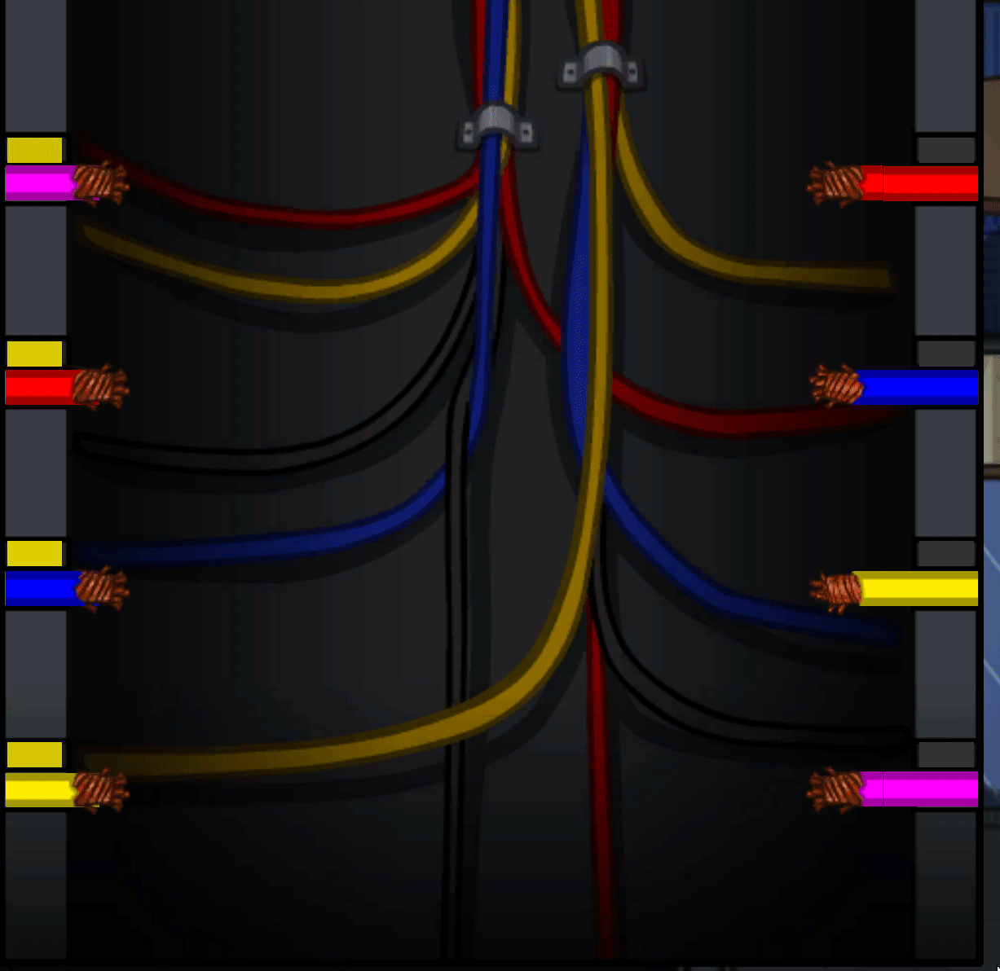

# Project Name
> Among Us Task Automation

## Table of contents
* [General info](#general-info)
* [Demonstration](#demonstration)
* [Technologies](#technologies)
* [Setup](#setup)
* [Features](#features)
* [Status](#status)
* [Inspiration](#inspiration)

## General info
This project aims to automate "tasks" that the player is required to complete in the game "Among Us" Tasks

## Demonstration
### After a brief peroid of image recognition, the script will automatically drag wires from the left to it's corresponding wire on the right.

## Technologies
* Pyautogui
* Pillow

## Setup
Download all files into one folder and ensure you have python 3+ installed locally

## Code Examples
Simply run completeTasks.py in a folder with all the assets and never worry about touching your mouse again!

## Features
List of features ready and TODOs for future development
* Full support for all tasks performed on the map POLUS
* Full support for all tasks performed on the map SKELD

To-do list:
* Add remainder of tasks to be completed on the map MIRA

## Status
Project is: _in progress_ as the game is updated, so will this project to ensure no human mouse movement is required!

## Inspiration
Thanks to the loveley devs over at InnerSloth for making this awesome game and filling my time with amazing experiences with my friends.
